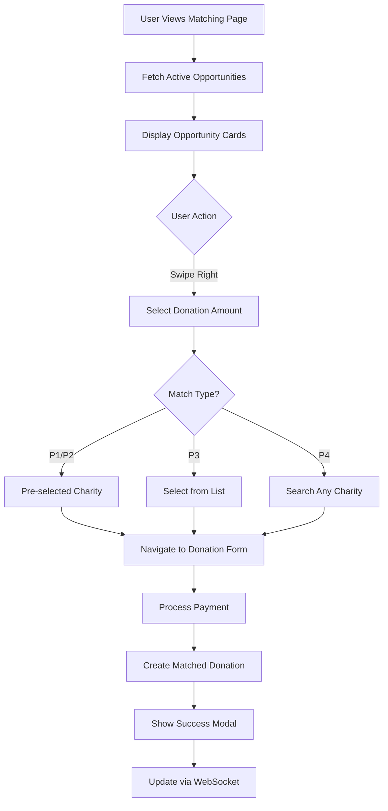

# Matching Opportunities Architecture Analysis

## Executive Summary

The matching opportunities feature is a core component of the Do-Nation platform that connects businesses offering donation matches with users making charitable contributions. This document provides a comprehensive analysis of the current implementation, identifies gaps, and proposes improvements for both frontend and backend systems.

## Current Architecture Overview

### System Design
The matching opportunities system follows a 4-tier priority model (P1-P4) that determines how users are matched with business donation campaigns:

```
P1: Direct Match → Pre-selected charity (highest priority)
P2: Category Auto → Auto-matched within category
P3: Category Choice → User selects from approved charities
P4: Open Match → User selects any charity
```

### Technology Stack
- **Frontend**: React with Material-UI components, Framer Motion animations
- **Backend**: Node.js API (separate repository at `/Users/josephheath/giving-dashboard`)
- **Real-time**: WebSocket for live updates
- **Database**: MongoDB/PostgreSQL for persistent storage

## Frontend Implementation Analysis

### Component Architecture

#### 1. MatchingPage Component (`/src/components/matching/MatchingPage.js`)
- **Purpose**: Main container for matching opportunities
- **Features**: 
  - Routes to donation form with opportunity data
  - Handles success modals
  - Clean, minimal state management

#### 2. MatchOpportunityFeed Component (`/src/components/matching/MatchOpportunityFeed.js`)
- **Purpose**: Displays swipeable cards of opportunities
- **Key Features**:
  - Real-time opportunity fetching via `matchingAPI.getActiveOpportunities()`
  - Dynamic charity name resolution for P1/P2 matches
  - Swipe gestures with Framer Motion
  - 4-tier priority badge system
  - Custom amount input with validation
  - WebSocket integration for live updates

#### 3. API Integration (`/src/services/api/matchingAPI.js`)
- **Endpoints**:
  - `GET /api/matching/opportunities` - Fetch active opportunities
  - `POST /api/donations/create-with-matching` - Create matched donation
  - `GET /api/campaigns/:id` - Get campaign details
  - `POST /api/matching/opportunities/:id/accept` - Accept opportunity

### User Flow



## Backend Integration Points

### API Endpoints (Inferred)

1. **Opportunity Management**
   ```
   GET /api/matching/opportunities
   Response: Array of opportunity objects with:
   - businessName, businessLogo
   - matchType, priority
   - multiplier, contribution
   - validUntil, remainingBudget
   - charityId/charityOptions (based on type)
   ```

2. **Donation Processing**
   ```
   POST /api/donations/create-with-matching
   Body: {
     amount, charityId, campaignId,
     isMonthly, includeMatching
   }
   Response: {
     donation, matchingData: { matches: [...] }
   }
   ```

3. **Real-time Updates**
   - WebSocket events: `campaignUpdate`, `matchNotification`, `budgetAlert`

## Database Schema (From `/docs/DATABASE_SCHEMA.md`)

### MatchingOpportunities Table
```sql
- _id: ObjectId (PRIMARY KEY)
- businessId: ObjectId (FOREIGN KEY)
- businessName: String
- charity: String (for P1/P2)
- cause: String (for P2/P3)
- charityOptions: Array[String] (for P3)
- multiplier: Float (default 2)
- contribution: Decimal
- startDate: DateTime
- endDate: DateTime
- remainingBudget: Decimal
- totalBudget: Decimal
- matchType: Enum (direct, category_auto, category_choice, open)
- priority: Integer (1-100)
```

## Identified Issues and Gaps

### 1. Critical Bug: Charity Selection State Loss

#### Problem
- **Issue**: When user searches and selects a charity in P4 matches, the selection shows a blue tick but is not recognized when "Match This" button is clicked
- **Root Cause**: The charity selection state is stored in `selectedCharityId` object keyed by opportunity ID, but the state may be lost during re-renders or when the opportunity data updates
- **Location**: MatchOpportunityFeed.js:452-456 and :233-236

#### Technical Analysis
```javascript
// Current implementation
onSelect={(charity) => {
  const charityId = charity._id || charity.id || charity.ABN;
  setSelectedCharityId(prev => ({...prev, [currentOpp.id]: charityId}));
  setShowCharitySearch(false);
}}

// Issue: When checking for selection
if (currentOpp.needsCharitySelection && !selectedCharityId[currentOpp.id]) {
  alert('Please select a charity for this match');
  return;
}
```

The problem occurs because:
1. The opportunity ID might change between selection and submission
2. State updates are asynchronous and may not persist properly
3. The component re-renders when switching between search and selection states

### 2. Card Overflow Issue

#### Problem
- **Issue**: Matching opportunity cards are too large and overflow into the Profile.js component
- **Root Cause**: Fixed height of 480px on `.cardStack` with too much content
- **Impact**: Content spills out, breaking the layout of the Profile page
- **Location**: MatchOpportunityFeed.module.css:17

#### Current CSS
```css
.cardStack {
  position: relative;
  height: 480px; /* Fixed height causing overflow */
  margin-bottom: 2rem;
}
```

### 3. P1-P4 System Complexity

#### Current Implementation Issues
- **Over-engineered**: Four tiers create confusion without clear value differentiation
- **Demo logic**: Uses index-based distribution (oppIndex % 4) for demo purposes
- **Inconsistent**: P2 (category_auto) and P3 (category_choice) have minimal functional difference
- **Location**: MatchOpportunityFeed.js:105-118

#### Analysis
The current system:
- P1: Direct match (pre-selected charity)
- P2: Category auto (needs charity selection from category)
- P3: Category choice (needs charity selection from list)
- P4: Open match (any charity)

P2 and P3 are functionally identical from user perspective - both require selecting a charity.

### 4. Additional Frontend Issues

#### Data Consistency
- **Problem**: Mock charity names generated for demo when real data unavailable
- **Impact**: Inconsistent user experience
- **Location**: MatchOpportunityFeed.js:184-201

#### Charity Loading
- **Problem**: Sequential API calls for charity details (not batched)
- **Impact**: Performance bottleneck with many charities
- **Location**: MatchOpportunityFeed.js:44-61

#### State Management
- **Problem**: Complex state tracking for selected charities across cards
- **Impact**: Potential state synchronization issues
- **Location**: Multiple useState hooks in MatchOpportunityFeed

### 5. Backend Integration Gaps

#### Missing Batch Endpoints
- No batch endpoint for fetching multiple charity details
- Each charity requires individual API call

#### Incomplete Error Handling
- Limited error feedback to users
- No retry mechanisms for failed matches

### 6. UX/UI Issues

#### Card Navigation
- No keyboard navigation support
- Limited accessibility features
- No card position indicator beyond dots

#### Charity Selection
- P3 dropdown shows "Loading..." without proper loading state
- P4 charity search embedded inline (poor mobile experience)

### 7. Business Logic Concerns

#### Budget Management
- No client-side budget validation before match
- Potential race conditions with multiple users

#### Match Validation
- Limited client-side validation of match eligibility
- Depends entirely on backend validation

## Recommendations for Improvement

### 1. Fix Critical Charity Selection Bug

#### Solution 1: Persist charity selection in parent state
```javascript
// In MatchingPage.js - lift state up
const [selectedCharities, setSelectedCharities] = useState({});

// Pass down to MatchOpportunityFeed
<MatchOpportunityFeed 
  onSelectOpportunity={handleSelectOpportunity}
  selectedCharities={selectedCharities}
  onCharitySelect={(oppId, charityId) => 
    setSelectedCharities(prev => ({...prev, [oppId]: charityId}))
  }
/>
```

#### Solution 2: Store charity ID directly on opportunity object with persistence
```javascript
// In MatchOpportunityFeed.js - Enhanced with persistence layer
const persistSelection = (oppId, charityId) => {
  // Store in sessionStorage as backup
  sessionStorage.setItem(`match_${oppId}`, JSON.stringify({
    charityId,
    timestamp: Date.now()
  }));
};

const recoverSelection = (oppId) => {
  const stored = sessionStorage.getItem(`match_${oppId}`);
  if (stored) {
    const { charityId, timestamp } = JSON.parse(stored);
    // Check if selection is still valid (< 30 min old)
    if (Date.now() - timestamp < 1800000) {
      return charityId;
    }
  }
  return null;
};

const handleCharitySelect = (charity) => {
  const charityId = charity._id || charity.id || charity.ABN;
  
  // Update opportunity directly
  setOpportunities(prev => prev.map(opp => 
    opp.id === currentOpp.id 
      ? { ...opp, selectedCharityId: charityId }
      : opp
  ));
  
  // Persist to sessionStorage
  persistSelection(currentOpp.id, charityId);
  
  // Track selection
  trackCharitySelection('charity_selected', {
    opportunityId: currentOpp.id,
    matchType: currentOpp.matchType,
    charityId
  });
  
  setShowCharitySearch(false);
};

// When checking - with recovery
if (currentOpp.needsCharitySelection) {
  const selectedId = currentOpp.selectedCharityId || recoverSelection(currentOpp.id);
  if (!selectedId) {
    trackCharitySelection('selection_missing', {
      opportunityId: currentOpp.id,
      matchType: currentOpp.matchType
    });
    alert('Please select a charity for this match');
    return;
  }
}
```

### 2. Fix Card Overflow Issue

#### CSS Solution
```css
/* MatchOpportunityFeed.module.css */
.cardStack {
  position: relative;
  min-height: 480px; /* Change from fixed height */
  max-height: 80vh; /* Prevent viewport overflow */
  margin-bottom: 2rem;
}

.card {
  position: absolute;
  width: 100%;
  max-width: 600px; /* Constrain width */
  background: white;
  border-radius: 1rem;
  box-shadow: 0 4px 20px rgba(0, 0, 0, 0.1);
  cursor: grab;
  user-select: none;
  overflow-y: auto; /* Allow scrolling within card */
  max-height: 75vh; /* Limit card height */
}

/* Responsive adjustments */
@media (max-width: 768px) {
  .cardStack {
    min-height: 400px;
    max-height: 70vh;
  }
  
  .card {
    max-height: 65vh;
  }
}

/* Fallback for very small screens */
.card {
  @supports not (height: 100vh) {
    max-height: 600px;
  }
}

/* Container query for modern browsers */
@container (max-height: 500px) {
  .card {
    max-height: 450px;
  }
  
  .cardContent {
    font-size: 0.9rem;
  }
  
  /* Compact mode for small containers */
  .businessInfo {
    padding-bottom: 0.5rem;
  }
  
  .quickAmounts {
    padding: 0.5rem 0;
  }
}

/* Ensure content doesn't overflow in Profile.js */
.matchingFeedContainer {
  contain: layout style;
  overflow: hidden;
}
```

### 3. Simplify to 3-Tier System

#### Proposed Simplification
```javascript
// New 3-tier system
const MATCH_TYPES = {
  DIRECT: 'direct',      // P1: Pre-selected charity
  CATEGORY: 'category',  // P2: Select from category (merge P2 & P3)
  OPEN: 'open'          // P3: Any charity
};

// Simplified mapping logic
const mapOpportunity = (opp) => {
  let matchType;
  
  if (opp.charityId) {
    matchType = MATCH_TYPES.DIRECT;
  } else if (opp.cause || opp.charityOptions?.length > 0) {
    matchType = MATCH_TYPES.CATEGORY;
  } else {
    matchType = MATCH_TYPES.OPEN;
  }
  
  return {
    ...opp,
    matchType,
    needsCharitySelection: matchType !== MATCH_TYPES.DIRECT
  };
};

// Simplified priority badges
const getPriorityBadge = (matchType) => {
  switch (matchType) {
    case MATCH_TYPES.DIRECT:
      return { icon: <FaTrophy />, text: 'Perfect Match', className: styles.priorityGold };
    case MATCH_TYPES.CATEGORY:
      return { icon: <FaMedal />, text: 'Category Match', className: styles.prioritySilver };
    case MATCH_TYPES.OPEN:
      return { icon: <FaStar />, text: 'Open Match', className: styles.priorityBronze };
  }
};
```

### 4. Enhanced Frontend Architecture

#### Race Condition Handling
```javascript
// Implement optimistic locking
const acceptOpportunity = async (opportunityId, amount, charityId) => {
  try {
    // Include version/timestamp in request
    const response = await api.post(`/api/matching/opportunities/${opportunityId}/accept`, {
      amount,
      charityId,
      expectedBudget: currentOpp.remainingBudget, // Backend validates this hasn't changed
      timestamp: currentOpp.lastUpdated
    });
    return response.data;
  } catch (error) {
    if (error.response?.status === 409) {
      // Budget changed - refresh and retry
      await refreshOpportunity(opportunityId);
      showNotification('This opportunity was updated. Please try again.');
    } else if (error.response?.status === 410) {
      // Opportunity expired
      showNotification('This opportunity has expired.');
      await fetchOpportunities();
    }
    throw error;
  }
};

// Backend validation
const validateMatchRequest = (req, res, next) => {
  const { amount, charityId, opportunityId, expectedBudget } = req.body;
  
  // Check if budget has changed
  if (opportunity.remainingBudget !== expectedBudget) {
    return res.status(409).json({ 
      error: 'Opportunity budget has changed',
      currentBudget: opportunity.remainingBudget
    });
  }
  
  // Validate charity is allowed for this opportunity
  if (opportunity.matchType === 'category' && 
      !opportunity.charityOptions.includes(charityId)) {
    return res.status(400).json({ 
      error: 'Selected charity not allowed for this match type' 
    });
  }
  
  next();
};
```

#### Performance Optimizations
```javascript
// Batch charity loading
const fetchCharityBatch = async (charityIds) => {
  const response = await api.post('/api/charities/batch', { ids: charityIds });
  return response.data;
};

// Implement React Query for caching
import { useQuery } from 'react-query';
const { data: opportunities } = useQuery(
  'matchingOpportunities',
  matchingAPI.getActiveOpportunities,
  { 
    staleTime: 30000, // 30 seconds
    cacheTime: 300000 // 5 minutes
  }
);

// Performance monitoring
const measureCardInteraction = () => {
  performance.mark('card-interaction-start');
  
  // After interaction completes
  performance.mark('card-interaction-end');
  performance.measure(
    'card-interaction',
    'card-interaction-start',
    'card-interaction-end'
  );
  
  // Send to analytics if > threshold
  const measure = performance.getEntriesByName('card-interaction')[0];
  if (measure.duration > 1000) {
    analytics.track('slow_card_interaction', {
      duration: measure.duration,
      opportunityType: currentOpp.matchType
    });
  }
};
```

#### State Management
```javascript
// Use reducer for complex state
const matchingReducer = (state, action) => {
  switch (action.type) {
    case 'SELECT_CHARITY':
      return {
        ...state,
        selectedCharities: {
          ...state.selectedCharities,
          [action.opportunityId]: action.charityId
        }
      };
    case 'SELECT_AMOUNT':
      return {
        ...state,
        selectedAmounts: {
          ...state.selectedAmounts,
          [action.opportunityId]: action.amount
        }
      };
    case 'RESET_SELECTIONS':
      return {
        ...state,
        selectedCharities: {},
        selectedAmounts: {}
      };
    default:
      return state;
  }
};
```

#### Accessibility
```javascript
// Add keyboard navigation
const handleKeyPress = (e) => {
  if (e.key === 'ArrowRight') handleSwipe('right');
  if (e.key === 'ArrowLeft') handleSwipe('left');
};
```

### 5. WebSocket Connection Resilience

```javascript
// Enhanced WebSocket handling
class ResilientWebSocket {
  constructor(url, token) {
    this.url = url;
    this.token = token;
    this.reconnectAttempts = 0;
    this.maxReconnectAttempts = 5;
    this.reconnectDelay = 1000;
    this.subscriptions = new Set();
  }
  
  connect() {
    this.ws = new WebSocket(this.url);
    
    this.ws.onclose = () => {
      if (this.reconnectAttempts < this.maxReconnectAttempts) {
        setTimeout(() => {
          this.reconnectAttempts++;
          this.connect();
        }, this.reconnectDelay * Math.pow(2, this.reconnectAttempts));
      }
    };
    
    this.ws.onopen = () => {
      this.reconnectAttempts = 0;
      // Resubscribe to all previous subscriptions
      this.subscriptions.forEach(sub => {
        this.ws.send(JSON.stringify({ 
          type: 'subscribe', 
          channel: sub,
          token: this.token 
        }));
      });
    };
    
    this.ws.onerror = (error) => {
      console.error('WebSocket error:', error);
      analytics.track('websocket_error', {
        error: error.message,
        reconnectAttempts: this.reconnectAttempts
      });
    };
  }
  
  subscribe(channel) {
    this.subscriptions.add(channel);
    if (this.ws.readyState === WebSocket.OPEN) {
      this.ws.send(JSON.stringify({ 
        type: 'subscribe', 
        channel,
        token: this.token 
      }));
    }
  }
}
```

### 6. Analytics & Monitoring

```javascript
// Comprehensive tracking for charity selection issue
const trackCharitySelection = (eventType, data) => {
  analytics.track('matching_charity_selection', {
    event: eventType,
    opportunityId: data.opportunityId,
    matchType: data.matchType,
    hasSelection: !!data.charityId,
    timestamp: Date.now(),
    sessionId: sessionStorage.getItem('session_id'),
    cardIndex: data.cardIndex
  });
};

// Error boundary for match component
class MatchErrorBoundary extends React.Component {
  componentDidCatch(error, errorInfo) {
    console.error('Match component error:', error, errorInfo);
    
    analytics.track('match_component_error', {
      error: error.toString(),
      componentStack: errorInfo.componentStack,
      timestamp: Date.now()
    });
    
    // Attempt recovery
    this.setState({ hasError: true });
    
    // Clear potentially corrupted state
    sessionStorage.removeItem('match_selections');
  }
  
  render() {
    if (this.state?.hasError) {
      return (
        <div className={styles.errorFallback}>
          <h3>Something went wrong with matching</h3>
          <button onClick={() => window.location.reload()}>
            Refresh Page
          </button>
        </div>
      );
    }
    
    return this.props.children;
  }
}
```

### 7. Backend API Improvements

#### New Endpoints
```javascript
// Batch charity endpoint
POST /api/charities/batch
Body: { ids: ["charity1", "charity2", ...] }
Response: { charities: { "charity1": {...}, "charity2": {...} } }

// Match preview endpoint
POST /api/matching/preview
Body: { opportunityId, amount, charityId }
Response: { valid: true, matchAmount: 50, totalImpact: 75 }
```

#### WebSocket Enhancements
```javascript
// Add opportunity-specific subscriptions
websocket.subscribe(`opportunity:${opportunityId}`, (update) => {
  // Handle budget updates, expiration, etc.
});
```

### 3. UX/UI Improvements

#### Enhanced Card Design
```jsx
// Add progress indicator
<ProgressBar 
  current={currentIndex + 1} 
  total={opportunities.length}
  showNumbers={true}
/>

// Improve charity selection UI
<CharitySelector
  type={opportunity.matchType}
  options={opportunity.charityOptions}
  onSelect={handleCharitySelect}
  loading={loadingCharities}
/>
```

#### Mobile Optimization
```css
/* Responsive card sizing */
@media (max-width: 768px) {
  .card {
    height: 70vh;
    width: 90vw;
  }
  
  .charitySearch {
    position: fixed;
    bottom: 0;
    left: 0;
    right: 0;
    height: 50vh;
  }
}
```

### 4. Business Logic Enhancements

#### Client-Side Validation
```javascript
const validateMatch = (opportunity, amount, charityId) => {
  const errors = [];
  
  if (amount < opportunity.minAmount || amount > opportunity.maxAmount) {
    errors.push(`Amount must be between $${opportunity.minAmount} and $${opportunity.maxAmount}`);
  }
  
  if (opportunity.remainingBudget < amount * opportunity.multiplier) {
    errors.push('Insufficient budget for this match');
  }
  
  if (opportunity.needsCharitySelection && !charityId) {
    errors.push('Please select a charity');
  }
  
  return errors;
};
```

#### Optimistic Updates
```javascript
const handleMatch = async () => {
  // Optimistically update UI
  setOpportunity(prev => ({
    ...prev,
    remainingBudget: prev.remainingBudget - matchAmount
  }));
  
  try {
    await processMatch();
  } catch (error) {
    // Rollback on failure
    setOpportunity(prev => ({
      ...prev,
      remainingBudget: prev.remainingBudget + matchAmount
    }));
  }
};
```

## Testing Strategy

### Comprehensive Test Suite for Charity Selection Bug

```javascript
// Test scenarios for charity selection bug
describe('Charity Selection State Management', () => {
  test('should persist charity selection through re-renders', async () => {
    const { getByText, rerender } = render(<MatchOpportunityFeed />);
    
    // Select a charity
    fireEvent.click(getByText('Select a Charity'));
    fireEvent.click(getByText('Test Charity'));
    
    // Force re-render
    rerender(<MatchOpportunityFeed />);
    
    // Verify selection persists
    expect(getByText('✓ Charity selected')).toBeInTheDocument();
  });
  
  test('should handle rapid card switching', async () => {
    const { getByText } = render(<MatchOpportunityFeed />);
    
    // Select charity on first card
    fireEvent.click(getByText('Select a Charity'));
    fireEvent.click(getByText('Charity 1'));
    
    // Quickly switch cards
    fireEvent.click(getByText('Skip'));
    fireEvent.click(getByText('Previous'));
    
    // Verify original selection maintained
    expect(getByText('✓ Charity selected')).toBeInTheDocument();
  });
  
  test('should recover from connection loss', async () => {
    // Simulate offline
    window.dispatchEvent(new Event('offline'));
    
    // Make selection
    const { getByText } = render(<MatchOpportunityFeed />);
    fireEvent.click(getByText('Select a Charity'));
    
    // Go back online
    window.dispatchEvent(new Event('online'));
    
    // Verify recovery from sessionStorage
    expect(sessionStorage.getItem('match_opp1')).toBeTruthy();
  });
  
  test('should validate charity selection before submission', async () => {
    const onSelect = jest.fn();
    const { getByText } = render(
      <MatchOpportunityFeed onSelectOpportunity={onSelect} />
    );
    
    // Try to submit without selection
    fireEvent.click(getByText('Match This'));
    
    // Verify warning and no submission
    expect(window.alert).toHaveBeenCalledWith(
      'Please select a charity for this match'
    );
    expect(onSelect).not.toHaveBeenCalled();
  });
});
```

## Migration Strategy

### 4-to-3 Tier System Migration

```javascript
// Backend migration script
const migratePrioritySystem = async () => {
  const db = await getDatabase();
  
  // Start transaction
  const session = await db.startSession();
  session.startTransaction();
  
  try {
    // Map P2 and P3 to new CATEGORY type
    await db.collection('matchingOpportunities').updateMany(
      { matchType: { $in: ['category_auto', 'category_choice'] } },
      { 
        $set: { 
          matchType: 'category',
          migratedFrom: { $cond: {
            if: { $eq: ['$matchType', 'category_auto'] },
            then: 'P2',
            else: 'P3'
          }},
          migratedAt: new Date()
        } 
      },
      { session }
    );
    
    // Update active campaigns
    await db.collection('campaigns').updateMany(
      { status: 'active', 'matchingDetails.type': { $in: ['category_auto', 'category_choice'] } },
      { 
        $set: { 
          'matchingDetails.type': 'category',
          'matchingDetails.migrated': true
        } 
      },
      { session }
    );
    
    await session.commitTransaction();
    console.log('Migration completed successfully');
  } catch (error) {
    await session.abortTransaction();
    console.error('Migration failed:', error);
    throw error;
  } finally {
    session.endSession();
  }
};

// User communication banner
const TierMigrationBanner = () => {
  const [dismissed, setDismissed] = useState(
    localStorage.getItem('tier-migration-dismissed')
  );
  
  if (dismissed) return null;
  
  return (
    <Banner type="info" dismissible onDismiss={() => {
      localStorage.setItem('tier-migration-dismissed', 'true');
      setDismissed(true);
    }}>
      <h4>Simplified Matching System</h4>
      <p>We've streamlined our matching categories to make it easier to find the perfect match for your donation.</p>
      <ul>
        <li><strong>Perfect Match</strong> - Pre-selected charity matches</li>
        <li><strong>Category Match</strong> - Choose from curated charities</li>
        <li><strong>Open Match</strong> - Match with any charity you love</li>
      </ul>
      <Link to="/help/matching-updates">Learn more</Link>
    </Banner>
  );
};
```

## Implementation Roadmap

### Immediate Actions (Next 48 Hours)

#### 1. Fix Charity Selection Bug
```bash
# Files to modify:
src/components/matching/MatchOpportunityFeed.js
src/components/matching/MatchingPage.js
```

**Steps:**
1. Lift charity selection state to MatchingPage component
2. Pass selection handlers down as props
3. Test thoroughly with P4 (open) matches
4. Add console logging to track state changes

#### 2. Fix Card Overflow
```bash
# File to modify:
src/components/matching/MatchOpportunityFeed.module.css
```

**CSS changes:**
- Change `.cardStack` height from fixed to min/max-height
- Add `overflow-y: auto` to `.card`
- Set max-height constraints
- Test on mobile and desktop views

#### 3. Simplify to 3-Tier System
```bash
# Files to modify:
src/components/matching/MatchOpportunityFeed.js
```

**Steps:**
1. Update opportunity mapping logic
2. Merge P2 and P3 into single "Category" type
3. Update UI badges and descriptions
4. Update backend API to support new system

### Phase 1: Critical Fixes (Week 1)
1. **Day 1-2**: Fix charity selection state bug
   - Implement Solution 2 (store on opportunity object)
   - Add comprehensive testing
   - Deploy hotfix

2. **Day 3-4**: Fix card overflow issue
   - Update CSS with responsive constraints
   - Test across all screen sizes
   - Ensure Profile.js layout integrity

3. **Day 5-7**: Simplify priority system
   - Implement 3-tier system
   - Update backend to match
   - Migration for existing data

### Phase 2: Performance & State (Week 2)
1. Implement proper state management (Context/Reducer)
2. Add batch charity loading endpoint
3. Implement caching with React Query
4. Add loading skeletons

### Phase 3: UX Enhancement (Week 3)
1. Redesign card for better mobile experience
2. Create modal for charity selection
3. Add keyboard navigation
4. Implement accessibility features

### Phase 4: Advanced Features (Week 4)
1. Add match preview/calculator
2. Real-time budget tracking
3. Match history view
4. Smart recommendations

## Summary of Critical Priorities

Based on the analysis and additional considerations, the three most critical actions are:

### 1. **Fix Charity Selection State Bug** (CRITICAL - Day 1)
- Implement Solution 2 with sessionStorage persistence
- Add comprehensive error tracking
- Deploy monitoring to verify fix effectiveness

### 2. **Fix Card Overflow Issue** (HIGH - Day 1-2)
- Update CSS with responsive constraints
- Add container queries for modern browsers
- Test across all device sizes

### 3. **Implement Race Condition Handling** (HIGH - Day 2-3)
- Add optimistic locking to match acceptance
- Implement proper error recovery
- Add WebSocket resilience

These fixes address the most user-impacting issues while the longer-term improvements (3-tier simplification, performance optimization) can be implemented in subsequent phases.

## Conclusion

The matching opportunities feature has a solid foundation but requires immediate attention to critical bugs affecting user experience. The enhanced solutions provided incorporate robust error handling, state persistence, and comprehensive monitoring to ensure reliability. The phased implementation approach prioritizes fixing critical issues first while planning for systematic improvements to create a world-class matching experience.

## Appendix: Key Files

### Frontend
- `/src/components/matching/MatchingPage.js` - Main container
- `/src/components/matching/MatchOpportunityFeed.js` - Card display logic
- `/src/services/api/matchingAPI.js` - API integration
- `/src/components/DonationForm.js` - Donation processing

### Backend (Referenced)
- `/api/matching/opportunities` - Opportunity endpoints
- `/api/donations/create-with-matching` - Matched donation creation
- WebSocket handlers for real-time updates

### Database
- MatchingOpportunities collection/table
- BusinessCampaigns for campaign management
- Donations with matching references