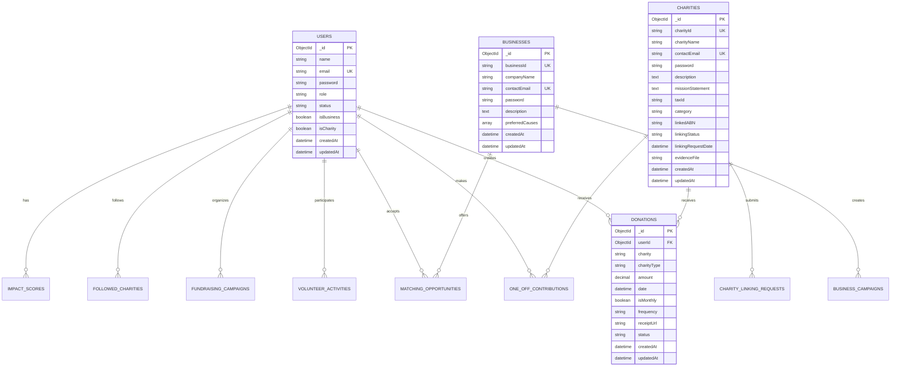

# Database Schema Documentation

## Overview
This document outlines the inferred database schema for the Donation Dashboard application based on the data structures observed in the frontend codebase. The actual backend implementation may use MongoDB, PostgreSQL, or another database system.

## Entity Relationship Diagram

## Table Definitions

### 1. Users Table

Stores all user accounts including regular users and admins.

| Column | Type | Constraints | Description |
|--------|------|-------------|-------------|
| _id | ObjectId | PRIMARY KEY | Unique identifier |
| name | String | NOT NULL | User's full name |
| email | String | UNIQUE, NOT NULL | User's email address |
| password | String | NOT NULL | Hashed password |
| role | String | DEFAULT 'user' | Enum: 'user', 'admin' |
| status | String | DEFAULT 'active' | Enum: 'active', 'suspended' |
| isBusiness | Boolean | DEFAULT false | Business account flag |
| isCharity | Boolean | DEFAULT false | Charity account flag |
| createdAt | DateTime | NOT NULL | Account creation timestamp |
| updatedAt | DateTime | NOT NULL | Last update timestamp |

**Indexes:**
- `email` (unique index)
- `role` (for filtering)
- `status` (for active user queries)

### 2. Businesses Table

Stores business partner information.

| Column | Type | Constraints | Description |
|--------|------|-------------|-------------|
| _id | ObjectId | PRIMARY KEY | Unique identifier |
| businessId | String | UNIQUE, NOT NULL | Business identifier |
| companyName | String | NOT NULL | Company name |
| contactEmail | String | UNIQUE, NOT NULL | Primary contact email |
| password | String | NOT NULL | Hashed password |
| description | Text | | Company description |
| preferredCauses | Array[String] | | List of preferred charitable causes |
| createdAt | DateTime | NOT NULL | Registration timestamp |
| updatedAt | DateTime | NOT NULL | Last update timestamp |

### 3. Charities Table

Stores verified charity organizations.

| Column | Type | Constraints | Description |
|--------|------|-------------|-------------|
| _id | ObjectId | PRIMARY KEY | Unique identifier |
| charityId | String | UNIQUE, NOT NULL | Charity identifier |
| charityName | String | NOT NULL | Official charity name |
| contactEmail | String | UNIQUE, NOT NULL | Contact email |
| password | String | NOT NULL | Hashed password |
| description | Text | | Charity description |
| missionStatement | Text | | Mission statement |
| taxId | String | | Tax identification number |
| category | String | | Charity category |
| linkedABN | String | | Australian Business Number |
| linkingStatus | String | DEFAULT 'pending' | Verification status |
| linkingRequestDate | DateTime | | Verification request date |
| evidenceFile | String | | Path to evidence document |
| createdAt | DateTime | NOT NULL | Registration timestamp |
| updatedAt | DateTime | NOT NULL | Last update timestamp |

**Category Enum Values:**
- `education`
- `health`
- `environment`
- `social-justice`
- `humanitarian`
- `animal-welfare`
- `arts-culture`

### 4. Donations Table

Records all donation transactions.

| Column | Type | Constraints | Description |
|--------|------|-------------|-------------|
| _id | ObjectId | PRIMARY KEY | Unique identifier |
| userId | ObjectId | FOREIGN KEY | Reference to Users table |
| charity | String | NOT NULL | Charity name |
| charityType | String | NOT NULL | Charity category |
| amount | Decimal | NOT NULL, > 0 | Donation amount |
| date | DateTime | NOT NULL | Donation date |
| isMonthly | Boolean | DEFAULT false | Recurring donation flag |
| frequency | String | | Donation frequency |
| receiptUrl | String | | Path to receipt file |
| status | String | DEFAULT 'pending' | Transaction status |
| createdAt | DateTime | NOT NULL | Record creation timestamp |
| updatedAt | DateTime | NOT NULL | Last update timestamp |

**Charity Type Enum Values:**
- `Health Services`
- `Mental Health`
- `Education`
- `Environmental Conservation`
- `Social Welfare`
- `Emergency Relief`
- `Food Security`
- `Child Welfare`
- `Indigenous Support`
- `Housing`
- `Community Building`
- `Rural Support`

### 5. OneOffContributions Table

Tracks one-time contributions and donations.

| Column | Type | Constraints | Description |
|--------|------|-------------|-------------|
| _id | ObjectId | PRIMARY KEY | Unique identifier |
| userId | ObjectId | FOREIGN KEY | Reference to Users table |
| charity | String | NOT NULL | Charity name |
| charityType | String | NOT NULL | Charity category |
| amount | Decimal | NOT NULL, > 0 | Contribution amount |
| date | DateTime | NOT NULL | Contribution date |
| subject | String | | Contribution purpose |
| createdAt | DateTime | NOT NULL | Record creation timestamp |
| updatedAt | DateTime | NOT NULL | Last update timestamp |

### 6. VolunteerActivities Table

Records volunteer work and time contributions.

| Column | Type | Constraints | Description |
|--------|------|-------------|-------------|
| _id | ObjectId | PRIMARY KEY | Unique identifier |
| userId | ObjectId | FOREIGN KEY | Reference to Users table |
| organization | String | NOT NULL | Organization name |
| charityType | String | NOT NULL | Organization category |
| hours | Integer | NOT NULL, > 0 | Hours volunteered |
| date | DateTime | NOT NULL | Activity date |
| description | Text | | Activity description |
| status | String | DEFAULT 'active' | Activity status |
| evidence | String | | Path to evidence file |
| startDate | DateTime | NOT NULL | Activity start date |
| endDate | DateTime | | Activity end date |
| createdAt | DateTime | NOT NULL | Record creation timestamp |
| updatedAt | DateTime | NOT NULL | Last update timestamp |

### 7. FundraisingCampaigns Table

Manages user-created fundraising campaigns.

| Column | Type | Constraints | Description |
|--------|------|-------------|-------------|
| _id | ObjectId | PRIMARY KEY | Unique identifier |
| userId | ObjectId | FOREIGN KEY | Reference to Users table |
| title | String | NOT NULL | Campaign title |
| description | Text | NOT NULL | Campaign description |
| charityType | String | NOT NULL | Beneficiary category |
| goalAmount | Decimal | NOT NULL, > 0 | Fundraising goal |
| raisedAmount | Decimal | DEFAULT 0 | Amount raised |
| startDate | DateTime | NOT NULL | Campaign start date |
| endDate | DateTime | NOT NULL | Campaign end date |
| campaignUrl | String | | Campaign webpage URL |
| status | String | DEFAULT 'active' | Campaign status |
| completedDate | DateTime | | Completion date |
| eventsOrganized | Integer | DEFAULT 0 | Number of events |
| onlineCampaignsInitiated | Integer | DEFAULT 0 | Online campaigns count |
| createdAt | DateTime | NOT NULL | Record creation timestamp |
| updatedAt | DateTime | NOT NULL | Last update timestamp |

### 8. FollowedCharities Table

Tracks user-followed charities.

| Column | Type | Constraints | Description |
|--------|------|-------------|-------------|
| _id | ObjectId | PRIMARY KEY | Unique identifier |
| userId | ObjectId | FOREIGN KEY | Reference to Users table |
| name | String | NOT NULL | Charity name |
| ABN | String | | Australian Business Number |
| Charity_Legal_Name | String | | Legal entity name |
| Town_City | String | | Location city |
| State | String | | Location state |
| Postcode | String | | Postal code |
| createdAt | DateTime | NOT NULL | Follow timestamp |
| updatedAt | DateTime | NOT NULL | Last update timestamp |

**Compound Index:**
- `(userId, ABN)` - Prevent duplicate follows

### 9. MatchingOpportunities Table

Business donation matching programs.

| Column | Type | Constraints | Description |
|--------|------|-------------|-------------|
| _id | ObjectId | PRIMARY KEY | Unique identifier |
| businessId | ObjectId | FOREIGN KEY | Reference to Businesses table |
| businessName | String | NOT NULL | Business name |
| message | String | | Opportunity message |
| charity | String | NOT NULL | Target charity |
| cause | String | NOT NULL | Charitable cause |
| contribution | Decimal | NOT NULL, > 0 | Business contribution |
| donationAmount | Decimal | NOT NULL, > 0 | User donation to match |
| multiplier | Float | DEFAULT 2 | Matching multiplier |
| startDate | DateTime | NOT NULL | Program start date |
| endDate | DateTime | NOT NULL | Program end date |
| accepted | Boolean | DEFAULT false | User acceptance flag |
| userId | ObjectId | FOREIGN KEY | Accepting user (nullable) |
| createdAt | DateTime | NOT NULL | Record creation timestamp |
| updatedAt | DateTime | NOT NULL | Last update timestamp |

### 10. BusinessCampaigns Table

Business-organized charitable campaigns.

| Column | Type | Constraints | Description |
|--------|------|-------------|-------------|
| _id | ObjectId | PRIMARY KEY | Unique identifier |
| businessId | ObjectId | FOREIGN KEY | Reference to Businesses table |
| name | String | NOT NULL | Campaign name |
| description | Text | NOT NULL | Campaign description |
| goal | Decimal | NOT NULL, > 0 | Campaign goal amount |
| currentAmount | Decimal | DEFAULT 0 | Current raised amount |
| startDate | DateTime | NOT NULL | Campaign start date |
| endDate | DateTime | NOT NULL | Campaign end date |
| targetAudience | String | NOT NULL | Target participants |
| status | String | DEFAULT 'active' | Campaign status |
| createdAt | DateTime | NOT NULL | Record creation timestamp |
| updatedAt | DateTime | NOT NULL | Last update timestamp |

**Target Audience Enum:**
- `employee`
- `customer`
- `all`

### 11. ImpactScores Table

Calculated user impact metrics.

| Column | Type | Constraints | Description |
|--------|------|-------------|-------------|
| _id | ObjectId | PRIMARY KEY | Unique identifier |
| userId | ObjectId | FOREIGN KEY, UNIQUE | Reference to Users table |
| totalScore | Integer | NOT NULL, >= 0 | Total impact score |
| donationScore | Integer | NOT NULL, >= 0 | Score from donations |
| volunteerScore | Integer | NOT NULL, >= 0 | Score from volunteering |
| fundraisingScore | Integer | NOT NULL, >= 0 | Score from fundraising |
| tier | String | NOT NULL | Impact tier |
| pointsToNextTier | Integer | NOT NULL, >= 0 | Points needed for next tier |
| calculatedAt | DateTime | NOT NULL | Calculation timestamp |

**Impact Tier Enum:**
- `Giver` (0-99 points)
- `Altruist` (100-499 points)
- `Philanthropist` (500-999 points)
- `Champion` (1000-4999 points)
- `Visionary` (5000+ points)

### 12. CharityLinkingRequests Table

Charity verification requests.

| Column | Type | Constraints | Description |
|--------|------|-------------|-------------|
| _id | ObjectId | PRIMARY KEY | Unique identifier |
| charityId | ObjectId | FOREIGN KEY | Reference to Charities table |
| charityABN | String | NOT NULL | Australian Business Number |
| evidenceFile | String | NOT NULL | Path to evidence document |
| status | String | DEFAULT 'pending' | Request status |
| submittedAt | DateTime | NOT NULL | Submission timestamp |
| reviewedAt | DateTime | | Review timestamp |
| reviewedBy | ObjectId | FOREIGN KEY | Reviewing admin (nullable) |

## Data Relationships

### One-to-Many Relationships
1. Users → Donations
2. Users → OneOffContributions
3. Users → VolunteerActivities
4. Users → FundraisingCampaigns
5. Users → FollowedCharities
6. Businesses → BusinessCampaigns
7. Businesses → MatchingOpportunities
8. Charities → CharityLinkingRequests

### One-to-One Relationships
1. Users ↔ ImpactScores

### Many-to-Many Relationships (Implicit)
1. Users ↔ Charities (through donations and follows)
2. Users ↔ MatchingOpportunities (when accepted)

## Indexing Strategy

### Primary Indexes
- All `_id` fields have primary key indexes

### Secondary Indexes
1. **Users**
   - `email` (unique)
   - `role`
   - `status`

2. **Donations**
   - `userId`
   - `date`
   - `status`
   - `charity`

3. **VolunteerActivities**
   - `userId`
   - `date`
   - `status`

4. **BusinessCampaigns**
   - `businessId`
   - `status`
   - `endDate`

### Compound Indexes
1. **FollowedCharities**
   - `(userId, ABN)` - Prevent duplicates

2. **Donations**
   - `(userId, date)` - User donation history
   - `(charity, date)` - Charity donation reports

## Data Integrity Constraints

### Foreign Key Constraints
All foreign key relationships should enforce referential integrity:
- `ON DELETE CASCADE` for dependent records (e.g., user donations)
- `ON DELETE RESTRICT` for critical relationships (e.g., business campaigns)

### Check Constraints
1. All monetary amounts must be positive
2. End dates must be after start dates
3. Email addresses must match valid format
4. Status fields must match enum values

### Unique Constraints
1. User emails must be unique
2. Business contact emails must be unique
3. Charity contact emails must be unique
4. One impact score per user

## Migration Considerations

### Adding New Tables
1. Create migration script with rollback capability
2. Add appropriate indexes
3. Set up foreign key relationships
4. Populate default data if needed

### Modifying Existing Tables
1. Use ALTER TABLE statements carefully
2. Consider data migration for schema changes
3. Update application code simultaneously
4. Test with production-like data volumes

### Performance Optimization
1. Regular index maintenance
2. Archival strategy for old donations
3. Partitioning for large tables
4. Read replicas for reporting queries