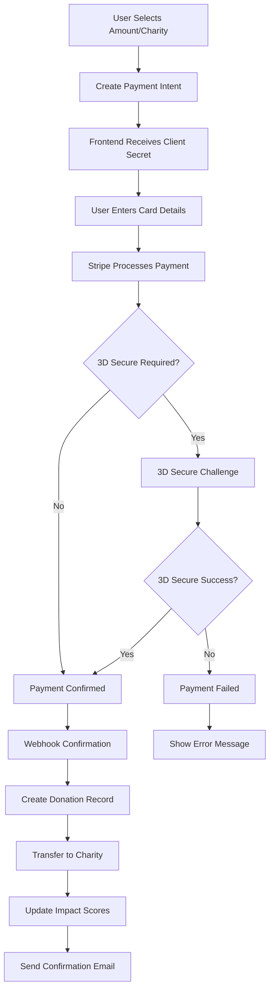

# Payment Integration Documentation

## Overview
The Do-Nation platform uses **Stripe** as its primary payment processor to handle charitable donations. This document covers the complete payment flow, implementation details, security considerations, and Stripe Connect integration for charity payouts.

## Table of Contents
1. [Payment Architecture](#payment-architecture)
2. [Stripe Integration](#stripe-integration)
3. [Payment Flow](#payment-flow)
4. [Stripe Connect for Charities](#stripe-connect-for-charities)
5. [Security Measures](#security-measures)
6. [Webhook Integration](#webhook-integration)
7. [Testing Guide](#testing-guide)
8. [Error Handling](#error-handling)
9. [Platform Fees](#platform-fees)

## Payment Architecture

### Core Components

1. **Stripe Configuration** (`/src/config/stripe.js`)
   - Centralized Stripe SDK initialization
   - API key management
   - Currency configuration

2. **Payment Routes** (`/src/routes/stripeRoutes.js`)
   - Payment intent creation
   - Payment method management
   - Refund processing
   - Receipt generation

3. **Stripe Connect Routes** (`/src/routes/stripeConnectRoutes.js`)
   - Charity onboarding
   - Account verification
   - Payout management

4. **Webhook Handler** (`/src/routes/stripeWebhooks.js`)
   - Payment confirmation
   - Failed payment handling
   - Refund notifications

### System Architecture

```
┌─────────────────────────────────────────────────────┐
│                   Frontend (React)                   │
├─────────────────────────────────────────────────────┤
│  ┌─────────────────┐    ┌─────────────────────┐   │
│  │ Donation Form   │    │ Payment Methods     │   │
│  │                 │    │ Management          │   │
│  │ - Amount input  │    │ - Save cards        │   │
│  │ - Charity select│    │ - Remove cards      │   │
│  │ - Payment UI    │    │ - Set default       │   │
│  └────────┬────────┘    └─────────────────────┘   │
│           │                                         │
│  ┌────────┴────────────────────────────┐          │
│  │     Stripe Elements/SDK             │          │
│  │  - Card input                       │          │
│  │  - Payment processing               │          │
│  │  - 3D Secure handling               │          │
│  └──────────────────┬──────────────────┘          │
└─────────────────────┴───────────────────────────────┘
                      │ API Calls
┌─────────────────────┴───────────────────────────────┐
│                  Backend API (Node.js)               │
├─────────────────────────────────────────────────────┤
│  ┌─────────────────┐    ┌─────────────────────┐   │
│  │ Stripe Routes   │    │ Stripe Connect      │   │
│  │                 │    │ Routes              │   │
│  │ - Create PI     │    │ - Onboard charity   │   │
│  │ - Process       │    │ - Verify account    │   │
│  │ - Refund        │    │ - Transfer funds    │   │
│  └────────┬────────┘    └──────────┬──────────┘   │
│           │                         │               │
│  ┌────────┴─────────────────────────┴──────────┐  │
│  │           Stripe Configuration               │  │
│  │         Platform fee calculation             │  │
│  │          Currency management                 │  │
│  └──────────────────┬──────────────────────────┘  │
└─────────────────────┴───────────────────────────────┘
                      │
         ┌────────────┴────────────┐
         │    Stripe Platform      │
         │  - Payment processing   │
         │  - Connect accounts     │
         │  - Webhook events       │
         └─────────────────────────┘
```

## Stripe Integration

### Configuration

```javascript
// src/config/stripe.js
const stripe = require('stripe')(process.env.STRIPE_SECRET_KEY);

// Platform fee configuration
const PLATFORM_FEE_PERCENTAGE = process.env.PLATFORM_FEE_PERCENTAGE || 2.9;

// Supported currencies
const SUPPORTED_CURRENCIES = ['usd', 'cad', 'eur', 'gbp', 'aud'];

module.exports = { stripe, PLATFORM_FEE_PERCENTAGE, SUPPORTED_CURRENCIES };
```

### Payment Intent Creation

```javascript
// Create payment intent endpoint
router.post('/create-payment-intent', async (req, res) => {
  const { amount, currency = 'usd', charityId, savePaymentMethod } = req.body;
  
  try {
    // Fetch charity's Stripe account
    const charity = await Charity.findById(charityId);
    if (!charity.stripeAccountId) {
      return res.status(400).json({ error: 'Charity not setup for payments' });
    }
    
    // Calculate platform fee
    const platformFee = Math.round(amount * PLATFORM_FEE_PERCENTAGE / 100);
    
    // Create payment intent
    const paymentIntent = await stripe.paymentIntents.create({
      amount,
      currency,
      application_fee_amount: platformFee,
      transfer_data: {
        destination: charity.stripeAccountId,
      },
      metadata: {
        charityId,
        donorId: req.user?.id,
        type: 'donation'
      }
    });
    
    res.json({
      clientSecret: paymentIntent.client_secret,
      paymentIntentId: paymentIntent.id
    });
  } catch (error) {
    res.status(500).json({ error: error.message });
  }
});
```

### Saved Payment Methods

```javascript
// Save payment method for future use
router.post('/save-payment-method', async (req, res) => {
  const { paymentMethodId } = req.body;
  
  try {
    // Attach payment method to customer
    await stripe.paymentMethods.attach(paymentMethodId, {
      customer: req.user.stripeCustomerId,
    });
    
    // Set as default if requested
    if (req.body.setAsDefault) {
      await stripe.customers.update(req.user.stripeCustomerId, {
        invoice_settings: {
          default_payment_method: paymentMethodId,
        },
      });
    }
    
    res.json({ success: true });
  } catch (error) {
    res.status(500).json({ error: error.message });
  }
});
```

## Payment Flow

### Complete Donation Process



### API Endpoints

#### Payment Endpoints (`/api/stripe/*`)
```javascript
// Create payment intent
POST /api/stripe/create-payment-intent
Body: {
  amount: 5000, // Amount in cents
  currency: "usd",
  charityId: "charity_123",
  savePaymentMethod: true
}

// Process refund
POST /api/stripe/process-refund
Body: {
  donationId: "donation_123",
  amount: 5000, // Optional partial refund
  reason: "requested_by_customer"
}

// Get payment methods
GET /api/stripe/payment-methods

// Delete payment method
DELETE /api/stripe/payment-methods/:id

// Generate receipt
GET /api/stripe/receipt/:donationId
```

## Stripe Connect for Charities

### Charity Onboarding Flow

1. **Account Creation**
```javascript
router.post('/create-connect-account', async (req, res) => {
  const { charityId } = req.body;
  
  const account = await stripe.accounts.create({
    type: 'express',
    country: 'US',
    capabilities: {
      card_payments: { requested: true },
      transfers: { requested: true },
    },
    metadata: {
      charityId
    }
  });
  
  // Save account ID to charity record
  await Charity.findByIdAndUpdate(charityId, {
    stripeAccountId: account.id
  });
  
  res.json({ accountId: account.id });
});
```

2. **Onboarding Link Generation**
```javascript
router.post('/create-account-link', async (req, res) => {
  const { accountId, refreshUrl, returnUrl } = req.body;
  
  const accountLink = await stripe.accountLinks.create({
    account: accountId,
    refresh_url: refreshUrl,
    return_url: returnUrl,
    type: 'account_onboarding',
  });
  
  res.json({ url: accountLink.url });
});
```

3. **Account Verification**
```javascript
router.get('/account-status/:accountId', async (req, res) => {
  const account = await stripe.accounts.retrieve(req.params.accountId);
  
  res.json({
    detailsSubmitted: account.details_submitted,
    chargesEnabled: account.charges_enabled,
    payoutsEnabled: account.payouts_enabled,
    requirements: account.requirements
  });
});
```

## Security Measures

### PCI Compliance
- **No Card Storage**: Card details never touch our servers
- **Tokenization**: All payments use Stripe tokens
- **SSL/TLS**: All payment communications encrypted
- **Stripe Elements**: Secure, PCI-compliant card input

### Implementation Security

```javascript
// Webhook signature verification
const endpointSecret = process.env.STRIPE_WEBHOOK_SECRET;

router.post('/webhook', express.raw({ type: 'application/json' }), (req, res) => {
  const sig = req.headers['stripe-signature'];
  
  try {
    const event = stripe.webhooks.constructEvent(
      req.body,
      sig,
      endpointSecret
    );
    
    // Handle event
    switch (event.type) {
      case 'payment_intent.succeeded':
        await handlePaymentSuccess(event.data.object);
        break;
      case 'payment_intent.payment_failed':
        await handlePaymentFailure(event.data.object);
        break;
      // ... other events
    }
    
    res.json({ received: true });
  } catch (err) {
    res.status(400).send(`Webhook Error: ${err.message}`);
  }
});
```

### Input Validation

```javascript
// Amount validation middleware
const validateAmount = (req, res, next) => {
  const { amount } = req.body;
  
  if (!amount || amount < 100) { // Minimum $1.00
    return res.status(400).json({ error: 'Invalid amount' });
  }
  
  if (amount > 999999) { // Maximum $9,999.99
    return res.status(400).json({ error: 'Amount exceeds maximum' });
  }
  
  next();
};

// Charity validation
const validateCharity = async (req, res, next) => {
  const { charityId } = req.body;
  
  const charity = await Charity.findById(charityId);
  if (!charity || !charity.stripeAccountId) {
    return res.status(400).json({ error: 'Invalid charity' });
  }
  
  req.charity = charity;
  next();
};
```

## Webhook Integration

### Event Handling

```javascript
// src/routes/stripeWebhooks.js
const handlePaymentSuccess = async (paymentIntent) => {
  const { metadata } = paymentIntent;
  
  // Create donation record
  const donation = new Donation({
    donor: metadata.donorId,
    charity: metadata.charityId,
    amount: paymentIntent.amount,
    currency: paymentIntent.currency,
    stripePaymentIntentId: paymentIntent.id,
    stripeChargeId: paymentIntent.latest_charge,
    paymentStatus: 'succeeded',
    platformFee: paymentIntent.application_fee_amount,
    netAmount: paymentIntent.amount - paymentIntent.application_fee_amount
  });
  
  await donation.save();
  
  // Update impact scores
  await updateCharityImpactScore(metadata.charityId);
  await updateDonorImpactScore(metadata.donorId);
  
  // Send confirmation email
  await sendDonationConfirmation(donation);
};

const handlePaymentFailure = async (paymentIntent) => {
  // Log failure
  logger.error('Payment failed:', {
    paymentIntentId: paymentIntent.id,
    error: paymentIntent.last_payment_error
  });
  
  // Update donation record if exists
  await Donation.findOneAndUpdate(
    { stripePaymentIntentId: paymentIntent.id },
    { paymentStatus: 'failed' }
  );
};
```

### Webhook Events

Key events handled:
- `payment_intent.succeeded` - Payment completed
- `payment_intent.payment_failed` - Payment failed
- `charge.refunded` - Refund processed
- `account.updated` - Connect account status change
- `transfer.created` - Funds transferred to charity

## Testing Guide

### Test Mode Setup

```bash
# .env.development
STRIPE_SECRET_KEY=sk_test_...
STRIPE_PUBLISHABLE_KEY=pk_test_...
STRIPE_WEBHOOK_SECRET=whsec_test_...
```

### Test Cards

```javascript
// Successful payment
4242 4242 4242 4242 (Visa)
5555 5555 5555 4444 (Mastercard)

// 3D Secure required
4000 0025 0000 3155

// Declined cards
4000 0000 0000 9995 (Insufficient funds)
4000 0000 0000 0002 (Generic decline)

// Error testing
4000 0000 0000 0119 (Processing error)
```

### Integration Testing

```javascript
describe('Stripe Payment Integration', () => {
  it('should create payment intent successfully', async () => {
    const response = await request(app)
      .post('/api/stripe/create-payment-intent')
      .send({
        amount: 5000,
        currency: 'usd',
        charityId: testCharity._id
      })
      .expect(200);
    
    expect(response.body).toHaveProperty('clientSecret');
    expect(response.body.clientSecret).toMatch(/^pi_/);
  });
  
  it('should handle webhook events', async () => {
    const payload = {
      id: 'evt_test',
      type: 'payment_intent.succeeded',
      data: {
        object: {
          id: 'pi_test',
          amount: 5000,
          metadata: {
            charityId: testCharity._id,
            donorId: testUser._id
          }
        }
      }
    };
    
    const signature = stripe.webhooks.generateTestHeaderString({
      payload: JSON.stringify(payload),
      secret: process.env.STRIPE_WEBHOOK_SECRET
    });
    
    await request(app)
      .post('/api/stripe/webhook')
      .set('stripe-signature', signature)
      .send(payload)
      .expect(200);
    
    // Verify donation was created
    const donation = await Donation.findOne({
      stripePaymentIntentId: 'pi_test'
    });
    expect(donation).toBeTruthy();
  });
});
```

## Error Handling

### Frontend Error Handling

```javascript
const handlePaymentError = (error) => {
  switch (error.code) {
    case 'card_declined':
      return 'Your card was declined. Please try a different card.';
    case 'insufficient_funds':
      return 'Your card has insufficient funds.';
    case 'processing_error':
      return 'An error occurred processing your card. Please try again.';
    case 'expired_card':
      return 'Your card has expired.';
    case 'incorrect_cvc':
      return 'Your card\'s security code is incorrect.';
    default:
      return 'An unexpected error occurred. Please try again.';
  }
};
```

### Backend Error Responses

```javascript
// Standardized error response
const sendErrorResponse = (res, statusCode, error) => {
  const response = {
    error: {
      message: error.message,
      code: error.code,
      type: error.type
    }
  };
  
  if (process.env.NODE_ENV === 'development') {
    response.error.stack = error.stack;
  }
  
  res.status(statusCode).json(response);
};
```

## Platform Fees

### Fee Structure
- **Default Platform Fee**: 2.9% of donation amount
- **Stripe Processing Fee**: Passed to donor or absorbed by platform
- **Minimum Donation**: $1.00 (100 cents)
- **Maximum Donation**: $9,999.99 (999,999 cents)

### Fee Calculation

```javascript
const calculateFees = (amount, coverFees = false) => {
  const platformFeePercentage = 2.9;
  const stripeFeePercentage = 2.9;
  const stripeFixedFee = 30; // 30 cents
  
  let donationAmount = amount;
  let platformFee = Math.round(amount * platformFeePercentage / 100);
  let stripeFee = Math.round(amount * stripeFeePercentage / 100) + stripeFixedFee;
  
  if (coverFees) {
    // Donor covers all fees
    const totalFees = platformFee + stripeFee;
    donationAmount = amount + totalFees;
  }
  
  return {
    donationAmount,
    platformFee,
    stripeFee,
    netToCharity: amount - platformFee
  };
};
```

## Monitoring and Analytics

### Key Metrics to Track
- Payment success rate
- Average donation amount
- Failed payment reasons
- Refund rate
- Platform fee revenue
- Time to charity payout

### Logging

```javascript
// Payment logging
logger.info('Payment processed', {
  paymentIntentId: paymentIntent.id,
  amount: paymentIntent.amount,
  currency: paymentIntent.currency,
  charityId: paymentIntent.metadata.charityId,
  donorId: paymentIntent.metadata.donorId,
  platformFee: paymentIntent.application_fee_amount
});
```

## Compliance

### Regulatory Requirements
- **KYC/AML**: Handled by Stripe Connect for charities
- **Tax Reporting**: 1099-K forms generated by Stripe
- **Data Protection**: PCI DSS Level 1 compliance via Stripe
- **Charity Verification**: 501(c)(3) status verification

### Receipts and Tax Documentation
- Automatic receipt generation for all donations
- PDF receipts with tax-deductible information
- Annual giving statements for donors
- IRS-compliant documentation

## Future Enhancements

1. **Recurring Donations**
   - Stripe Subscriptions integration
   - Donation scheduling
   - Automated retry logic

2. **Alternative Payment Methods**
   - Apple Pay / Google Pay
   - ACH bank transfers
   - Cryptocurrency donations

3. **Enhanced Features**
   - Donation campaigns
   - Peer-to-peer fundraising
   - Corporate matching integration
   - Multi-currency optimization

4. **Advanced Analytics**
   - Donor lifetime value
   - Conversion funnel analysis
   - A/B testing for donation forms
   - Predictive analytics for donor behavior