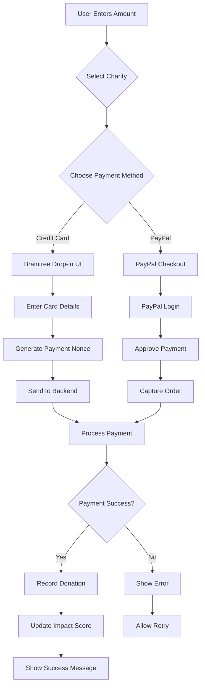

# Payment Integration Documentation

## Overview
The Donation Dashboard integrates two major payment processors - Braintree (for credit/debit cards) and PayPal - to provide flexible payment options for charitable donations. This document covers the complete payment flow, implementation details, and security considerations.

## Table of Contents
1. [Payment Architecture](#payment-architecture)
2. [Braintree Integration](#braintree-integration)
3. [PayPal Integration](#paypal-integration)
4. [Payment Flow](#payment-flow)
5. [Security Measures](#security-measures)
6. [Testing Guide](#testing-guide)
7. [Error Handling](#error-handling)
8. [Best Practices](#best-practices)

## Payment Architecture

### Core Components

1. **ManagePaymentsComponent.js** - Main payment interface
   - Location: `/src/components/Donations/ManagePaymentsComponent.js`
   - Handles payment method selection
   - Manages amount input and charity selection
   - Integrates both payment providers

2. **DonationModal.js** - Donation recording interface
   - Location: `/src/components/Donations/DonationModal.js`
   - Records donation details after payment
   - Handles receipt uploads
   - Manages recurring donation settings

3. **Payment Providers**
   - Braintree Web Drop-in React
   - React PayPal JS SDK

### System Architecture

```
┌─────────────────────────────────────────────────────┐
│                   Frontend (React)                   │
├─────────────────────────────────────────────────────┤
│  ┌─────────────────┐    ┌─────────────────────┐   │
│  │ ManagePayments  │    │   DonationModal     │   │
│  │   Component     │    │                     │   │
│  │                 │    │ - Record donation   │   │
│  │ - Amount input  │    │ - Upload receipt    │   │
│  │ - Charity select│    │ - Set recurring     │   │
│  │ - Payment UI    │    │                     │   │
│  └────────┬────────┘    └─────────────────────┘   │
│           │                                         │
│  ┌────────┴────────────────────────────┐          │
│  │         Payment Providers           │          │
│  ├──────────────────┬──────────────────┤          │
│  │    Braintree     │     PayPal       │          │
│  │   Drop-in UI     │    JS SDK        │          │
│  └──────────────────┴──────────────────┘          │
└─────────────────────┬───────────────────────────────┘
                      │ API Calls
┌─────────────────────┴───────────────────────────────┐
│                  Backend API                         │
├─────────────────────────────────────────────────────┤
│  ┌─────────────────┐    ┌─────────────────────┐   │
│  │   Braintree     │    │      PayPal         │   │
│  │   Endpoints     │    │    Endpoints        │   │
│  │                 │    │                     │   │
│  │ - Client token  │    │ - Create order      │   │
│  │ - Process       │    │ - Capture order     │   │
│  │   payment       │    │                     │   │
│  └────────┬────────┘    └──────────┬──────────┘   │
│           │                         │               │
└───────────┴─────────────────────────┴───────────────┘
            │                         │
┌───────────┴───────────┐ ┌───────────┴───────────┐
│   Braintree Gateway   │ │    PayPal Gateway     │
└───────────────────────┘ └───────────────────────┘
```

## Braintree Integration

### Setup and Configuration

```javascript
import DropIn from "braintree-web-drop-in-react";

// Component state
const [clientToken, setClientToken] = useState(null);
const [instance, setInstance] = useState(null);

// Fetch client token on mount
useEffect(() => {
  const fetchClientToken = async () => {
    try {
      const response = await axios.get(
        `${process.env.REACT_APP_API_BASE_URL}/api/braintree/client_token`
      );
      setClientToken(response.data.clientToken);
    } catch (error) {
      console.error("Error fetching client token:", error);
    }
  };
  fetchClientToken();
}, []);
```

### Braintree Drop-in UI Implementation

```javascript
{clientToken && (
  <DropIn
    options={{
      authorization: clientToken,
      paypal: {
        flow: "vault"
      }
    }}
    onInstance={(instance) => setInstance(instance)}
  />
)}
```

### Payment Processing

```javascript
const handleBraintreePayment = async () => {
  try {
    // Request payment method from Drop-in UI
    const { nonce } = await instance.requestPaymentMethod();
    
    // Send nonce to backend
    const response = await axios.post(
      `${process.env.REACT_APP_API_BASE_URL}/api/braintree/checkout`,
      {
        paymentMethodNonce: nonce,
        amount: donationAmount,
        charityId: selectedCharity
      }
    );
    
    if (response.data.success) {
      alert("Payment successful!");
      // Record donation in system
      // Navigate to success page
    }
  } catch (error) {
    console.error("Payment failed:", error);
    alert("Payment failed. Please try again.");
  }
};
```

### Test Credit Card Numbers

For development and testing:
```
Valid Cards:
- 4111111111111111 (Visa)
- 5555555555554444 (Mastercard)
- 378282246310005 (American Express)

Invalid Cards:
- 4000111111111115 (Processor declined)
- 4000000000000002 (Luhn invalid)

3D Secure:
- 4000000000001091 (Authentication required)
```

## PayPal Integration

### Setup and Configuration

```javascript
import { PayPalScriptProvider, PayPalButtons } from "@paypal/react-paypal-js";

// PayPal Script Provider wrapper
<PayPalScriptProvider
  options={{
    "client-id": process.env.REACT_APP_PAYPAL_CLIENT_ID,
    currency: "USD"
  }}
>
  {/* PayPal buttons component */}
</PayPalScriptProvider>
```

### PayPal Buttons Implementation

```javascript
<PayPalButtons
  disabled={!donationAmount || !selectedCharity}
  forceReRender={[donationAmount, selectedCharity]}
  fundingSource={undefined}
  createOrder={(data, actions) => {
    return actions.order.create({
      purchase_units: [
        {
          amount: {
            value: donationAmount,
            currency_code: "USD",
          },
          description: `Donation to ${selectedCharityName}`,
        },
      ],
      application_context: {
        shipping_preference: "NO_SHIPPING",
      },
    });
  }}
  onApprove={async (data, actions) => {
    try {
      // Capture the order
      const order = await actions.order.capture();
      
      // Send order details to backend
      const response = await axios.post(
        `${process.env.REACT_APP_API_BASE_URL}/api/paypal/capture-order`,
        {
          orderId: order.id,
          charityId: selectedCharity,
        }
      );
      
      if (response.data.success) {
        alert("PayPal payment successful!");
        // Record donation
        // Navigate to success
      }
    } catch (error) {
      console.error("PayPal capture failed:", error);
      alert("Payment capture failed");
    }
  }}
  onError={(err) => {
    console.error("PayPal error:", err);
    alert("PayPal payment failed");
  }}
/>
```

## Payment Flow

### Complete Payment Process



### API Endpoints

#### Braintree Endpoints
```javascript
// Get client token
GET /api/braintree/client_token
Response: { clientToken: "eyJ2ZXJzaW9uIjoyLC..." }

// Process payment
POST /api/braintree/checkout
Body: {
  paymentMethodNonce: "tokencc_bf_xyz...",
  amount: "50.00",
  charityId: "charity123"
}
Response: { 
  success: true,
  transaction: { id: "trans_123", status: "submitted_for_settlement" }
}
```

#### PayPal Endpoints
```javascript
// Capture order
POST /api/paypal/capture-order
Body: {
  orderId: "ORDER-123456789",
  charityId: "charity123"
}
Response: { 
  success: true,
  captureId: "CAPTURE-123456789"
}
```

## Security Measures

### PCI Compliance

1. **No Card Data Storage**: Credit card details never touch our servers
2. **Tokenization**: All payments use tokens/nonces instead of raw card data
3. **SSL/TLS**: All payment communications encrypted in transit
4. **Hosted Fields**: Payment forms hosted by payment providers

### Implementation Security

```javascript
// Validate amount on frontend
const validateAmount = (amount) => {
  const numAmount = parseFloat(amount);
  return !isNaN(numAmount) && numAmount > 0 && numAmount <= 10000;
};

// Sanitize inputs
const sanitizeInput = (input) => {
  return input.replace(/[<>]/g, '');
};

// Secure headers for API calls
const secureHeaders = {
  'Content-Type': 'application/json',
  'X-Requested-With': 'XMLHttpRequest',
  'Authorization': `Bearer ${token}`
};
```

### Backend Validation

```javascript
// Example backend validation (conceptual)
const validatePaymentRequest = (req) => {
  const { amount, charityId, paymentMethodNonce } = req.body;
  
  // Validate amount
  if (!amount || parseFloat(amount) <= 0) {
    throw new Error('Invalid amount');
  }
  
  // Validate charity exists
  if (!isValidCharity(charityId)) {
    throw new Error('Invalid charity');
  }
  
  // Validate nonce format
  if (!isValidNonce(paymentMethodNonce)) {
    throw new Error('Invalid payment method');
  }
  
  return true;
};
```

## Testing Guide

### Development Environment Setup

1. **Environment Variables**
```bash
# .env.local
REACT_APP_API_BASE_URL=http://localhost:3002
REACT_APP_PAYPAL_CLIENT_ID=your_sandbox_client_id
REACT_APP_BRAINTREE_MERCHANT_ID=your_sandbox_merchant_id
```

2. **Sandbox Accounts**
- Braintree: https://sandbox.braintreegateway.com
- PayPal: https://developer.paypal.com/developer/accounts

### Test Scenarios

#### Successful Payment Flow
```javascript
// Test data
const testPayment = {
  amount: "25.00",
  charity: "Red Cross",
  cardNumber: "4111111111111111",
  expiry: "12/25",
  cvv: "123"
};

// Expected: Payment processes successfully
```

#### Failed Payment Scenarios
1. **Insufficient Funds**
   - Card: 4000111111111115
   - Expected: "Insufficient Funds" error

2. **Invalid Card**
   - Card: 4000000000000002
   - Expected: "Invalid card number" error

3. **Network Timeout**
   - Simulate slow network
   - Expected: Timeout error with retry option

### Integration Testing

```javascript
// Example integration test
describe('Payment Integration', () => {
  it('should process Braintree payment successfully', async () => {
    // Mock client token response
    axios.get.mockResolvedValueOnce({ 
      data: { clientToken: 'mock_token' } 
    });
    
    // Mock payment processing
    axios.post.mockResolvedValueOnce({ 
      data: { success: true } 
    });
    
    // Render component and simulate payment
    const { getByText, getByLabelText } = render(<ManagePaymentsComponent />);
    
    // Enter amount
    fireEvent.change(getByLabelText('Amount'), { 
      target: { value: '50' } 
    });
    
    // Select charity
    fireEvent.change(getByLabelText('Select Charity'), { 
      target: { value: 'charity123' } 
    });
    
    // Click pay button
    fireEvent.click(getByText('Pay with Card'));
    
    // Assert success message
    await waitFor(() => {
      expect(getByText('Payment successful!')).toBeInTheDocument();
    });
  });
});
```

## Error Handling

### Frontend Error Handling

```javascript
const PaymentErrorBoundary = ({ children }) => {
  const [hasError, setHasError] = useState(false);
  const [error, setError] = useState(null);
  
  const resetError = () => {
    setHasError(false);
    setError(null);
  };
  
  if (hasError) {
    return (
      <div className="error-container">
        <h3>Payment Error</h3>
        <p>{error?.message || 'An unexpected error occurred'}</p>
        <button onClick={resetError}>Try Again</button>
      </div>
    );
  }
  
  return children;
};
```

### Common Error Messages

```javascript
const errorMessages = {
  'NETWORK_ERROR': 'Network connection failed. Please check your internet connection.',
  'INVALID_AMOUNT': 'Please enter a valid donation amount.',
  'NO_CHARITY_SELECTED': 'Please select a charity before proceeding.',
  'PAYMENT_DECLINED': 'Your payment was declined. Please try a different payment method.',
  'INSUFFICIENT_FUNDS': 'Insufficient funds. Please try a different payment method.',
  'EXPIRED_CARD': 'Your card has expired. Please use a different card.',
  'INVALID_CVV': 'Invalid security code. Please check your card details.',
  'TIMEOUT': 'Payment request timed out. Please try again.',
  'SERVER_ERROR': 'Server error. Please try again later.',
};
```

### Error Recovery Strategies

1. **Automatic Retry**
```javascript
const retryPayment = async (paymentFunction, maxRetries = 3) => {
  let attempt = 0;
  
  while (attempt < maxRetries) {
    try {
      return await paymentFunction();
    } catch (error) {
      attempt++;
      if (attempt === maxRetries) throw error;
      await new Promise(resolve => setTimeout(resolve, 1000 * attempt));
    }
  }
};
```

2. **Fallback Payment Methods**
```javascript
const handlePaymentFailure = (error, currentMethod) => {
  if (currentMethod === 'braintree') {
    setShowPayPalOption(true);
    setMessage('Card payment failed. Try PayPal instead?');
  }
};
```

## Best Practices

### 1. Amount Validation
```javascript
const formatAmount = (value) => {
  // Remove non-numeric characters
  const cleaned = value.replace(/[^\d.]/g, '');
  
  // Ensure only one decimal point
  const parts = cleaned.split('.');
  if (parts.length > 2) {
    return parts[0] + '.' + parts.slice(1).join('');
  }
  
  // Limit to 2 decimal places
  if (parts[1]?.length > 2) {
    return parts[0] + '.' + parts[1].slice(0, 2);
  }
  
  return cleaned;
};
```

### 2. Loading States
```javascript
const PaymentButton = ({ loading, disabled, onClick, children }) => (
  <button 
    onClick={onClick} 
    disabled={disabled || loading}
    className={`payment-button ${loading ? 'loading' : ''}`}
  >
    {loading ? <Spinner /> : children}
  </button>
);
```

### 3. Success Feedback
```javascript
const PaymentSuccess = ({ amount, charity, transactionId }) => (
  <div className="success-message">
    <CheckCircleIcon />
    <h3>Thank you for your donation!</h3>
    <p>Your ${amount} donation to {charity} has been processed.</p>
    <p>Transaction ID: {transactionId}</p>
    <button onClick={() => navigate('/donations')}>
      View Your Donations
    </button>
  </div>
);
```

### 4. Accessibility
```javascript
// ARIA labels for payment forms
<label htmlFor="donation-amount">
  Donation Amount
  <span className="required" aria-label="required">*</span>
</label>
<input
  id="donation-amount"
  type="number"
  aria-describedby="amount-error"
  aria-invalid={!!amountError}
  aria-required="true"
/>
{amountError && (
  <span id="amount-error" role="alert">
    {amountError}
  </span>
)}
```

### 5. Mobile Optimization
```css
/* Responsive payment forms */
.payment-container {
  max-width: 100%;
  padding: 1rem;
}

@media (max-width: 768px) {
  .payment-buttons {
    flex-direction: column;
  }
  
  .payment-button {
    width: 100%;
    margin-bottom: 1rem;
  }
}
```

## Compliance and Regulations

### PCI DSS Compliance
- Level 4 compliance through hosted payment fields
- No direct handling of card data
- Regular security assessments
- Secure coding practices

### Data Protection
- GDPR compliance for EU users
- Minimal data collection
- Secure data transmission
- Right to deletion support

### Financial Regulations
- Anti-money laundering checks
- Transaction limits
- Charity verification
- Tax receipt generation

## Future Enhancements

1. **Additional Payment Methods**
   - Apple Pay integration
   - Google Pay support
   - Cryptocurrency donations
   - Bank transfer options

2. **Enhanced Features**
   - Recurring donation management
   - Payment method vault
   - Multi-currency support
   - Gift donation options

3. **Analytics and Reporting**
   - Payment success rates
   - Average donation amounts
   - Payment method preferences
   - Failed payment analysis